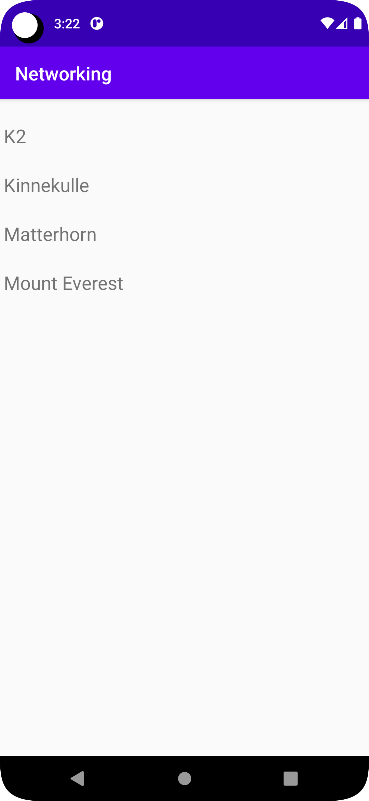

# Rapport

För denna uppgift var uppdraget att hämta och visa JSON data i en RecyclerView.
Jag började med att skapa en Mountain class som hämtar namnen på bergen.
Därefter skapas RecyclerViewAdapter, ViewHolder sedan implementeras den i MainActivity för att visa upp bergens namn.

Mountain class hämtar bergens namn
```
public class Mountain {
    private String name;

    public Mountain(String name) {
        this.name = name;
    }

    public String getName() {
        return name;
    }
}
```

ViewHolder kopplar RecyclerView med textview som ska visa bergsnamn
```
class ViewHolder extends RecyclerView.ViewHolder {
    public TextView name;

    public ViewHolder(@NonNull View itemView) {
        super(itemView);
        name = itemView.findViewById(R.id.name);
    }
}
```

RecyclerView implementeras i MainActivity
```
recyclerViewAdapter = new RecyclerViewAdapter(mountains);

RecyclerView = findViewById(R.id.RecyclerView);
RecyclerView.setLayoutManager(new LinearLayoutManager(this));
RecyclerView.setAdapter(recyclerViewAdapter);
```

